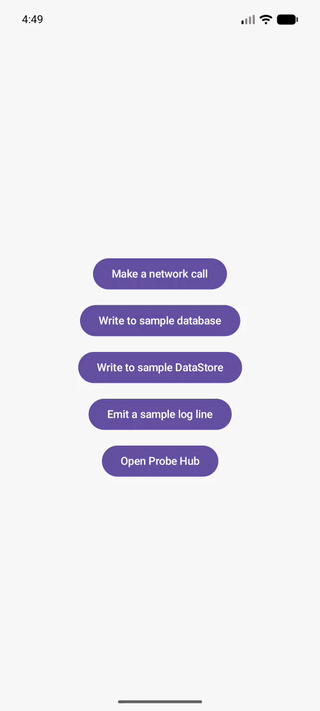
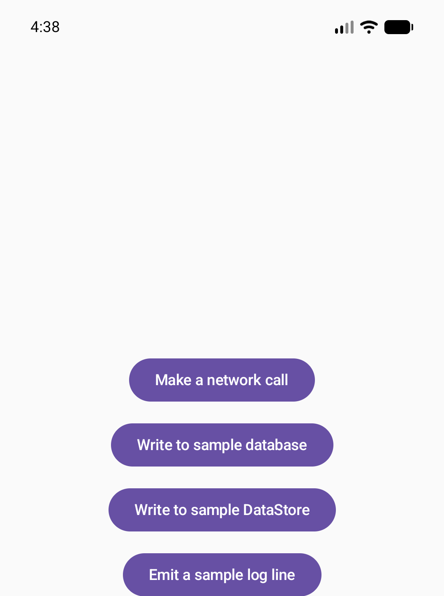
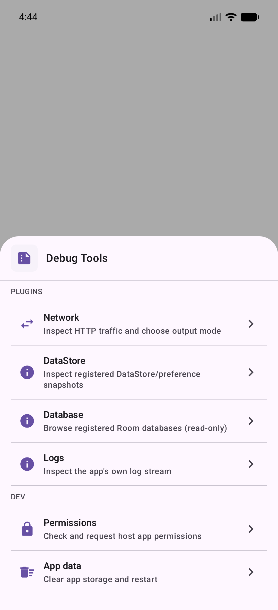

# Probe

[](https://central.sonatype.com/artifact/com.dev.probe/probe-api)
[](https://github.com/subhamkhemka1993/Probe/actions/workflows/ci.yml)
[](LICENSE)

Probe is an on-device debug shell for **Kotlin Multiplatform + Compose Multiplatform** apps
(Android and iOS). It gives you an in-app network inspector, a read-only Room database browser, a
DataStore/preferences viewer, and a live log stream — all reachable from inside a running app,
without a debugger, a proxy, or a cable attached.

It ships as two modules so it structurally cannot leak into a release build: `probe-api` (always
present, dependency-light, no-op by default) and `probe-runtime` (the real implementation,
`debugImplementation`-only).

<br>

<p align="center">
  
</p>

<p align="center">
  
  
  
  
</p>

<br>

## Capabilities

- **[Network inspector](docs/guide/capability-reference.md#network-inspector-in-app)** — every
  HTTP request/response your Ktor client makes, searchable, with a tabbed request/response detail
  view.
- **[Browser-based network inspector](docs/guide/capability-reference.md#browser-based-network-inspector)** —
  the same captured traffic, live, in a desktop browser on the same network.
- **[Database inspector](docs/guide/capability-reference.md#database-inspector)** — browse any
  registered `RoomDatabase`'s tables and rows, generically, with zero DAO or schema declaration
  required.
- **[DataStore inspector](docs/guide/capability-reference.md#datastore-inspector)** — a live view
  of any registered preferences/settings `Flow`.
- **[Log inspector](docs/guide/capability-reference.md#log-inspector)** — your app's own log
  stream, filterable by tag or message, fed by whatever logging library you already use.
- **[Export](docs/guide/capability-reference.md#export)** — turn a session's captured calls into
  JSON, HAR, or a `curl` command.
- **[Dev actions](docs/guide/integration-android.md)** — clear app data, inspect runtime
  permissions.
- **[Theming](docs/guide/capability-reference.md#theming)** — recolor the debug shell to match
  your app's brand.

See the [capability reference](docs/guide/capability-reference.md) for the full list, including
what's iOS/Android-specific.

<br>

## 🖇 Integrate Probe in your application

### Add Gradle dependencies

Probe is distributed through [**Maven Central**](https://central.sonatype.com/artifact/com.dev.probe/probe-api).
`probe-api` is tiny and dependency-light enough to sit in every build variant; `probe-runtime` is
the actual implementation and should only ever be `debugImplementation`.

```kotlin
val probeVersion = "0.1.0"

dependencies {
    // Always present — safe no-op hooks, present even in release builds.
    implementation("com.dev.probe:probe-api:$probeVersion")
    // The real implementation — present only in debug builds.
    debugImplementation("com.dev.probe:probe-runtime:$probeVersion")
}
```

> No separate `-no-op` artifact to add: when `probe-runtime` isn't on the classpath (e.g. a
> release build), every `probe-api` call is already a safe no-op by construction — see
> [architecture.md](docs/guide/architecture.md).

### Initialize Probe

One call, made once, from code that runs on every build variant:

```kotlin
// Android — e.g. from Application.onCreate()
ProbeInstaller.install(
    config = ProbeConfig(isEnabled = { BuildConfig.DEBUG }),
    platform = ProbePlatformContext(context),
)
```

```kotlin
// iOS — as early as possible, e.g. from a Kotlin wrapper called in Swift's App.init()
installProbeTools(
    config = ProbeConfig(isEnabled = { true }),
    platform = ProbePlatformContext(),
)
```

### Wire the pieces you want captured

Each capability opts in with one call, at the same call site where you already build that
resource — no dependency-injection framework, no per-build-type branching:

```kotlin
// Network — in your Ktor HttpClientConfig builder
val client = HttpClient(engine) {
    ProbeHttpCapture.run { installCapture() }
}

// Database — wherever you build your RoomDatabase
ProbeDatabaseCapture.register("MyDatabase", myRoomDatabase)

// DataStore — wherever you build your DataStore<Preferences>
ProbeDataStoreCapture.register("MySettings", myDataStore.data)

// Logs — from whatever logging library's writer chain you already have
ProbeLogSink.write(severity, tag, message, throwable)
```

🎉 **You're all set!** Open the debug hub from anywhere with `ProbeHub.openHub(platformContext)`.

See [usage-examples.md](docs/guide/usage-examples.md) for more copy-paste snippets (lifecycle
wiring, theming, remote-config-backed flags), and the full
[integration guide](docs/guide/integration-guide.md) for every step in detail.

<br>

## Try it: the sample app

This repository *is* the sample app. `androidApp`/`shared` wire Probe end-to-end and add one demo
button per capability (fire a network call, write to a sample database, write to a sample
DataStore, emit a log line), so opening the hub always has real data to show.

<p align="center">
  
  
</p>

- **Android:** `./gradlew :androidApp:assembleDebug`, or run it from your IDE's run widget.
- **iOS:** open [`/iosApp`](iosApp) in Xcode and run it from there.

See [integration-android.md](docs/guide/integration-android.md) /
[integration-ios.md](docs/guide/integration-ios.md) for exactly how the sample's own wiring
works.

<br>

## 📖 Full documentation

The [framework guide](docs/guide/README.md) is the deep dive — architecture, per-capability
reference, configuration, security model, troubleshooting, and how to extend Probe with your own
inspector plugin.

<br>

## Contributing to this repository

- [`docs/git-guide.md`](docs/git-guide.md) — branch naming, commit conventions, keeping the guide
  in sync with source changes.
- [`docs/coding-guardrails.md`](docs/coding-guardrails.md) — formatting/lint conventions.
- Run `./scripts/setup-dev-env.sh` once after cloning to install this repo's git hooks.
- Tests: `./gradlew test` (all host tests) or `./gradlew :shared:testAndroidHostTest` /
  `./gradlew :shared:iosSimulatorArm64Test` for one target.
- Releasing a new version: [`docs/guide/publishing.md`](docs/guide/publishing.md).

<br>

## 📃 License

```
Copyright 2025 Probe contributors

Licensed under the Apache License, Version 2.0 (the "License");
you may not use this file except in compliance with the License.
You may obtain a copy of the License at

   http://www.apache.org/licenses/LICENSE-2.0

Unless required by applicable law or agreed to in writing, software
distributed under the License is distributed on an "AS IS" BASIS,
WITHOUT WARRANTIES OR CONDITIONS OF ANY KIND, either express or implied.
See the License for the specific language governing permissions and
limitations under the License.
```
