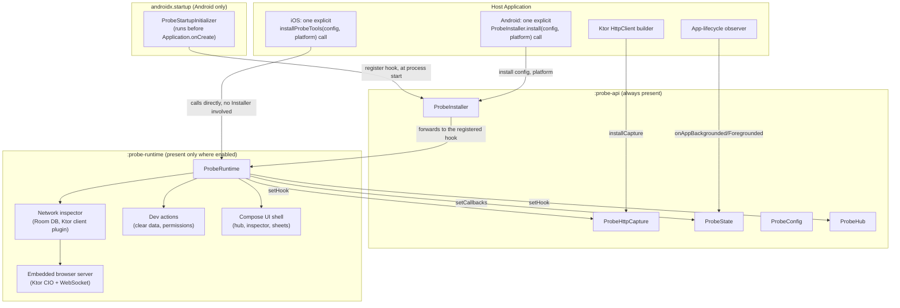

← [Guide index](README.md)

# Architecture

probe ships as two Gradle/KMP modules with a deliberate size split:

- **`:probe-api`** — a tiny, dependency-light module meant to be present in *every* build
  variant on *every* platform. It holds only settable-hook objects and configuration types:
  `ProbeHttpCapture` (Ktor capture hook), `ProbeCrashCapture` (exception/crash capture hook),
  `ProbeState` (app-lifecycle hook), `ProbeConfig`
  (the single host-configuration seam), `ProbeThemeOverride`, and the `ProbeInspector` marker
  interface. It has no database, no embedded server, and no UI toolkit beyond `compose.ui`'s
  `Color` type (needed only for the theme override). A host's networking and app-lifecycle code
  depends on this module directly, unconditionally.
- **`:probe-runtime`** — the actual implementation: the network inspector, embedded browser server,
  Room database, DataStore-backed preferences, session manager, dev actions, and the Compose UI
  shell. This module is meant to be present only where you actually want the tool available (a
  debug build, or gated by a runtime flag on a platform with no build-type axis).

Both modules share the `com.dev.probe` / `com.dev.probe.api` package hierarchy, and
`:probe-runtime` depends on `:probe-api` (as an `api` dependency, since `:probe-api` types appear in
`:probe-runtime`'s own public signatures).

**Settable-hook pattern.** `ProbeHttpCapture`, `ProbeState`, `ProbeHub`, and `ProbeLogSink` are
always-present singleton objects with a no-op default implementation. When `:probe-runtime` is
initialized, it calls `setHook`/`setCallbacks`/`setWriter` on them to install the real
implementation; before that (release builds where `:probe-runtime` is absent, or before
initialization on a build where it's present), calls into these objects are silent no-ops. This
is the mechanism that lets host code (Ktor client setup, lifecycle observers, an "open the hub"
button, a logging library's writer chain) call into probe *unconditionally*, without any
`if (debugBuildType)` branching in host code — no dependency-injection framework is involved at
all. `ProbeDataStoreCapture` and `ProbeDatabaseCapture` follow a related shape but as *named
registries* rather than a single hook, so a host can register any number of resources under
distinct names. Both expose their registry as a `StateFlow<Map<String, ...>>` (`registrations`),
not just a point-in-time `snapshot()`, so their inspector UIs stay live if a resource
registers/unregisters after the panel is already open — see
[capability-reference.md](capability-reference.md#datastore-inspector) and
[capability-reference.md](capability-reference.md#database-inspector). `ProbeInstaller` uses a closely related pattern but with no meaningful no-op: it's the
seam that carries the one-time initialization call itself (see [integration-guide.md](integration-guide.md),
Step 2), and before anything registers a real hook on it, calling `install` is simply dropped rather than
doing something safe-but-real like the other three.

**Runtime lifecycle.** `ProbeRuntime.initialize(config, platform, scope)` builds the full
dependency graph (database, repository, browser controller, notifier) exactly once per process
and installs the hooks described above; `ProbeRuntime.shutdown()` tears it all down, including
unregistering Probe's own database from `ProbeDatabaseCapture` and clearing `ProbeLogSink`'s
writer, so neither is left pointing at a torn-down `ProbeServices` instance. `isEnabled` is read
once at the top of graph construction and reused throughout — installing the real HTTP hook,
registering Probe's own database, and installing the real log writer all gate on that single
captured value, so a flag flip mid-construction can't produce a torn state where only some of
these are wired up. A host
triggers `initialize` exactly once, via `ProbeInstaller.install(config, platform)` on Android or
directly via `installProbeTools(config, platform)` on iOS (see [integration-guide.md](integration-guide.md),
Step 2) — never by constructing `ProbeRuntime` or any dependency-injection module — and never calls
`shutdown` explicitly in normal operation.

---
← [Guide index](README.md) · Next: [Requirements](requirements.md)
