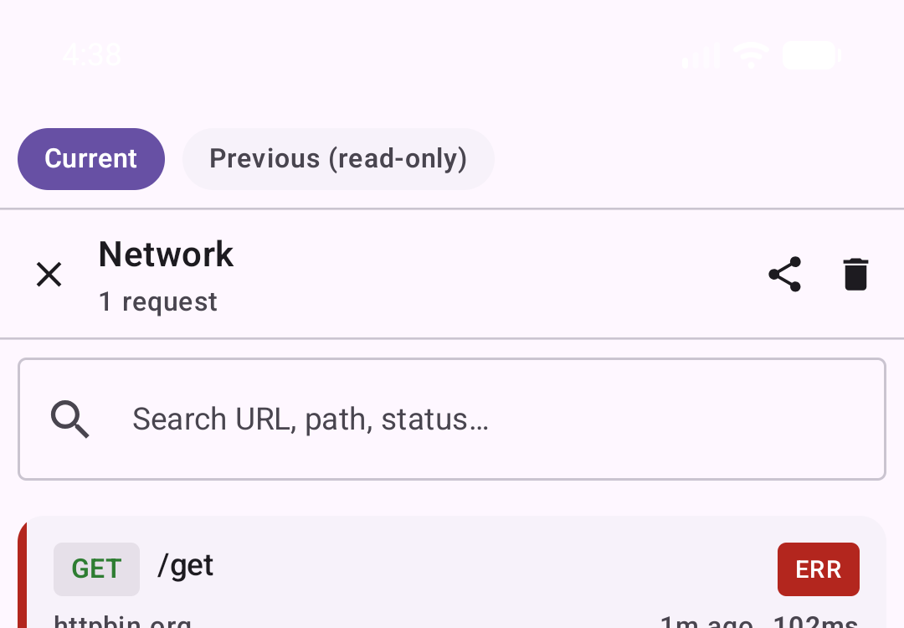
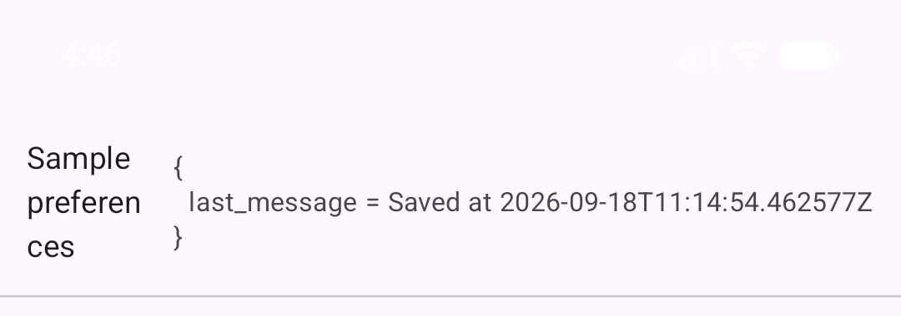
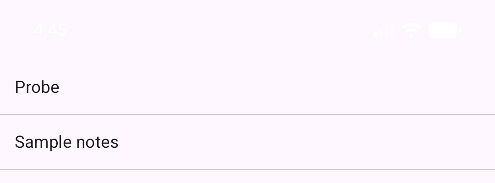
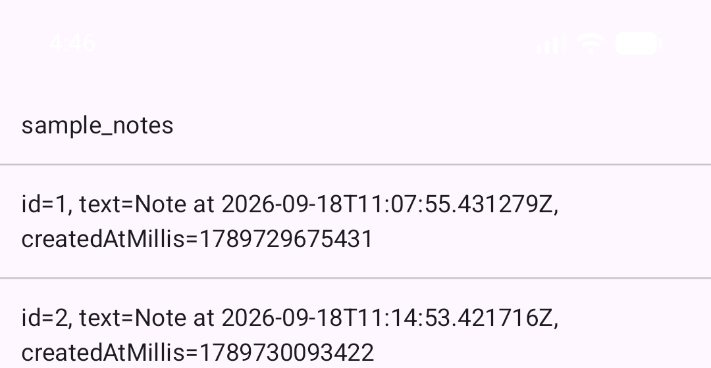
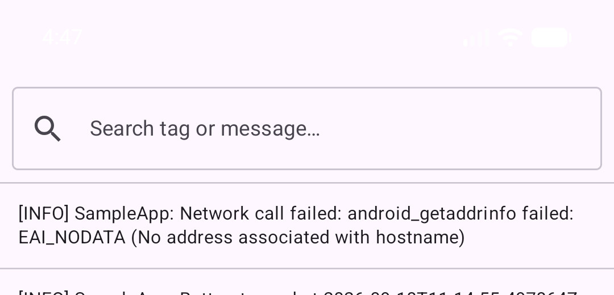

← [Guide index](README.md)

# Capability Reference

## Network inspector (in-app)

- **What it is:** A list + detail view of every HTTP request captured through the installed Ktor
  client hook.
- **Why it's useful:** Debugging API integration issues on-device without a proxy or a debugger.
- **How to use it:** Open the debug hub → tap "Network" → browse the list (search by URL/path/
  method/status), tap a row for the Overview/Request/Response tabbed detail view. Each row can be
  cleared individually via the list's clear action (scoped to the currently viewed session).
- **Configuration:** none beyond `ProbeConfig.isEnabled`; internal caps are a 250-entry count cap
  per session and a 250,000-byte truncation limit per body (`ProbeCaptureLimits`, not exposed to hosts).
- **Platform support:** both, identical implementation (`commonMain`).
- **Limitations:** binary response bodies (image/audio/video/font/octet-stream/pdf/zip/gzip/
  protobuf content types) are recorded as `[binary body omitted]` rather than captured, to avoid
  buffering large downloads into memory.

## Browser-based network inspector

- **What it is:** An embedded HTTP+WebSocket server (Ktor CIO) serving a small vanilla-JS single
  page app that mirrors the same captured traffic live, reachable from a desktop browser on the
  same network.
- **Why it's useful:** A bigger screen, easier copy/paste, or inspecting traffic without touching
  the device.
- **How to use it:** Open the debug hub → "Network" mode picker → select "Browser inspector". The
  UI shows the LAN URL (with an embedded token) and a "Copy link"/"Copy token" action; on an
  Android emulator or iOS Simulator, an additional row/accordion explains how to reach it from
  your development machine (`adb forward` for emulator; a direct loopback URL for Simulator).
- **Configuration:** not exposed to `ProbeConfig` — internal defaults are port `8765`, LAN bind
  policy, an 8-hour session token TTL, and auto-stop on backgrounding.
- **Platform support:** both — the server itself is `commonMain` code; only address discovery
  (Wi-Fi IP, emulator/simulator detection, device name) is platform-specific.
- **Limitations:** the server auto-stops when the app backgrounds (closing the unauthenticated-
  LAN exposure window) and must be manually restarted (by reopening the mode picker, or it
  auto-restarts via the persisted output-mode restore on foreground) — see
  [troubleshooting-and-faq.md#usage-gaps](troubleshooting-and-faq.md#usage-gaps) for a caveat on this restore behavior.

## Export

- **What it is:** Turns the currently-viewed session's captured calls into JSON, HAR, or a
  `curl`-command bundle, then hands it to the OS share sheet.
- **Why it's useful:** Attaching evidence to a bug report, or replaying a request from a terminal.
- **How to use it:** From the network list, use the export/share action; from a single request's
  detail view, "Copy as curl" is available directly.
- **Configuration:** none.
- **Platform support:** both — export formatting is `commonMain`; only the OS share-sheet
  presentation (`shareFile`/`shareText`) is platform-specific.
- **Limitations:** exported headers are redacted the same way as displayed ones (see
  [security.md](security.md)).

## Session history

- **What it is:** Tracking of "current" (this process) vs. "previous" (last process) captured
  traffic, toggled via a chip row in the network inspector.
- **Why it's useful:** Comparing behavior across an app restart without losing the prior run's
  data immediately.
- **How to use it:** The "Previous (read-only)" chip is enabled once a previous session exists;
  selecting it shows that session's calls without allowing clears.
- **Configuration:** none — at most two sessions are retained; anything older is deleted when a
  new session is promoted.
- **Platform support:** both (`commonMain`).
- **Limitations:** only one process of history is retained, not an arbitrary session log.

## Clear app data (dev action)

See the per-platform description in [integration-ios.md](integration-ios.md) /
[integration-android.md](integration-android.md). Full reset on Android; scoped clear + host
callback on iOS.

## Permissions inspector (dev action)

See the per-platform description in the integration guides above. Backed by moko-permissions on
both platforms; gated by manifest/`Info.plist` declaration.

## Theming

- **What it is:** A `ProbeThemeOverride` passed via `ProbeConfig` that recolors the debug shell's
  own Material 3 theme (primary/background/surface/text/success/warning/error).
- **Why it's useful:** Making the debug tool feel native to your app's brand instead of visually
  clashing with it.
- **How to use it:** `ProbeConfig(isEnabled = { ... }, themeOverride = ProbeThemeOverride(primary = MyBrand.primary, ...))`.
- **Platform support:** both.
- **Limitations:** colors only — typography is fixed and not overridable.

## DataStore inspector

- **What it is:** A live-updating list of every resource registered via
  `ProbeDataStoreCapture.register`, each rendered through its own registration's redactor.
- **Why it's useful:** Inspecting a host app's preference/settings state on-device without
  adding host-specific debug UI.
- **How to use it:** Open the debug hub → tap "DataStore" → the panel lists one row per
  registered resource, updating live as the underlying `Flow` emits.
- **Configuration:** none exposed to `ProbeConfig`; each resource opts in individually via
  `ProbeDataStoreCapture.register(name, snapshot, redactor)`.
- **Platform support:** both, identical implementation (`commonMain`).
- **Limitations:** read-only — no editing a value from the panel. The default redactor is plain
  `toString()`; a host registering a type with sensitive fields must pass its own redactor (see
  `ProbeDataStoreCapture.register`'s KDoc) — Probe cannot detect this for the host. The
  registered-resource list itself updates live (not just each resource's value), and a
  redactor/flow failure for one registration renders as an error value for that row only, rather
  than blanking or crashing the whole panel.

## Database inspector

 

- **What it is:** A read-only browser (databases → tables → rows) over every `RoomDatabase`
  registered via `ProbeDatabaseCapture.register`, including Probe's own network-call database.
- **Why it's useful:** Inspecting a host app's persisted data on-device without a separate DB
  browser tool or a rooted/jailbroken device.
- **How to use it:** Open the debug hub → tap "Database" → pick a registered database → pick a
  table → browse its first 50 rows.
- **Configuration:** none exposed to `ProbeConfig`; databases opt in individually via
  `ProbeDatabaseCapture.register(name, database)`.
- **Platform support:** both, identical implementation (`commonMain`) — table/column/row
  discovery uses Room's public `useReaderConnection`/`usePrepared` API, not a Dao.
- **Limitations:** read-only, one page (50 rows) per table in v1; BLOB columns render as
  `[blob N bytes]` rather than their contents. The registered-database list updates live if a
  database registers/unregisters while the panel is open; a table/row read failure (e.g. a
  malformed table) renders inline as an error row instead of crashing the host app.

## Log inspector

- **What it is:** A live, filterable view of the host app's own log stream, captured through
  `ProbeLogSink` — a logging-library-agnostic sink the host wires from whatever logging library
  it uses.
- **Why it's useful:** Reading recent log lines on-device without a debugger or `adb logcat`
  attached, especially useful on iOS where there's no equivalent to `logcat`.
- **How to use it:** Open the debug hub → tap "Logs" → search by tag or message text.
- **Configuration:** ring buffer size is `ProbeCaptureLimits.maxLogEntries` (default 1,000),
  internal only, not exposed to `ProbeConfig`.
- **Platform support:** both, identical implementation (`commonMain`) — the host adapts whatever
  logging library it uses to call `ProbeLogSink.write`.
- **Limitations:** in-memory only, not persisted across process restarts; log lines emitted
  before `ProbeGraphFactory.create()` installs the real writer are lost (same class of gap as
  `ProbeHttpCapture`'s pre-installation no-op window). A captured exception renders as a one-line
  `ExceptionClass: message` summary, not the full stack trace — a full trace would blow up that
  row's height unbounded in a list meant for a quick scroll.

## iOS vs Android Feature Matrix

| Capability | iOS | Android | Notes |
|---|---|---|---|
| Network inspector (in-app list + detail) | ✅ | ✅ | Identical `commonMain` implementation. |
| Browser-based network inspector | ✅ | ✅ | Server code is shared; only address/device discovery differs. |
| Export (JSON / HAR / curl) | ✅ | ✅ | Shared formatting; platform-specific share-sheet presentation. |
| Session history (current/previous) | ✅ | ✅ | Shared. |
| Sticky/persistent capture notification | ✅ | ✅ | Same `CaptureNotifierBridge`; iOS uses `UNUserNotificationCenter`, Android a `NotificationChannel`. |
| Notification tap → open hub | ⚠️ | ✅ | Android's `PendingIntent` is self-contained; iOS requires host-app code in its notification delegate (see [integration-ios.md](integration-ios.md)). |
| Home-screen launcher icon | ❌ | ✅ | No iOS equivalent exists in this implementation. |
| Clear app data | ⚠️ | ✅ | Android does a real full reset; iOS can only do a scoped clear (OS limitation, not a probe gap). |
| Permissions inspector | ✅ | ✅ | Same UI/controller contract; declaration source differs (`Info.plist` vs. manifest). |
| Theming override | ✅ | ✅ | Shared. |
| `ProbeHttpCapture` / `ProbeState` always-present hooks | ✅ | ✅ | `:probe-api`, shared. |
| DataStore inspector | ✅ | ✅ | Shared `commonMain` — `ProbeDataStoreCapture` registry, no platform-specific code. |
| Database inspector | ✅ | ✅ | Shared `commonMain` — `ProbeDatabaseCapture` registry + `useReaderConnection`, no platform-specific code. |
| Log inspector | ✅ | ✅ | Shared `commonMain` — `ProbeLogSink` is logging-library-agnostic, no platform-specific code. |
| Structural release-build exclusion | — | ✅ | Not applicable on iOS — there is no build-type dependency axis to exclude a module from; iOS relies solely on the `isEnabled` runtime flag. |

---
← [Guide index](README.md) · Previous: [iOS integration](integration-ios.md) · Next: [Configuration reference](configuration-reference.md)
