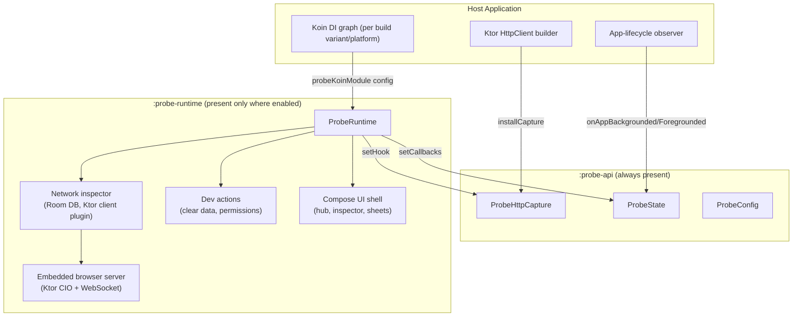

# probe

probe is a Kotlin Multiplatform (Android + iOS) embedded debug shell: an in-app network
inspector, request/response viewer, LAN browser-based traffic viewer, and a small set of
developer actions (clear app data, permission inspection), all reachable from inside a running
app without a debugger attached. It is built for Compose Multiplatform apps that use Ktor for
networking and Koin for dependency injection.

The problem it solves: verifying "what did this app actually send/receive over the network" or
"what's in this app's debug preferences right now" on a real device — especially a tester's or a
teammate's device — usually means attaching a proxy, plugging in a cable, or asking someone to
read logs over Slack. probe puts that inspector *inside the app*, gated so it structurally
cannot ship to production, and reachable by a developer or QA tester without any extra tooling
on their machine.

> **Scope of this document.** This describes probe's own capabilities and integration surface,
> independent of any specific host application. Where an example is drawn from this repository's
> own integration, it is explicitly labeled as such — the API and behavior described are the
> library's, not this host app's.

## Table of Contents

- [Features](#features)
- [Architecture](#architecture)
- [Requirements](#requirements)
- [Integration Guide](#integration-guide)
- [iOS Integration](#ios-integration)
- [Android Integration](#android-integration)
- [Capability Reference](#capability-reference)
- [iOS vs Android Feature Matrix](#ios-vs-android-feature-matrix)
- [Usage Gaps](#usage-gaps)
- [Usage Examples](#usage-examples)
- [Configuration Reference](#configuration-reference)
- [Security & Production Considerations](#security--production-considerations)
- [Troubleshooting](#troubleshooting)
- [FAQ](#faq)
- [Extensibility](#extensibility)
- [Development](#development)

## Features

**Network inspector.** Every request made through a Ktor `HttpClient` that installs probe's
capture hook is recorded — method, URL, headers, body, status, duration, and errors — and can be
browsed in-app as a scrollable list with search, and a per-request detail view with Overview /
Request / Response tabs. Sensitive headers (`Authorization`, `Cookie`, `X-Api-Key`,
`X-Auth-Token`, `sessiontoken`) are redacted to `***` wherever a call is displayed or exported.

**Browser-based network inspector.** Instead of (or alongside) the in-app list, probe can start
an embedded HTTP + WebSocket server (Ktor CIO engine) and serve a small single-page web app that
shows the same captured traffic live in a desktop browser on the same LAN — useful when you want
a bigger screen or to keep the device's own screen free. Access is token-gated (an 8-hour-TTL
bearer token, also accepted as a `?token=` query parameter) and the server is bound to the LAN
(`0.0.0.0`) or loopback depending on configuration.

**Export.** A captured session can be exported and shared (via the OS share sheet) as pretty JSON,
a [HAR](https://www.softwareishard.com/blog/har-12-spec/) file (importable into browser dev tools
or other HAR viewers), or a bundle of `curl` commands — one per request. A single request can
also be copied as one `curl` command from its detail view.

**Session history.** probe tracks network activity per OS process ("session"). The current
session is always writable; the previous process's session is retained read-only so you can
compare "what happened last run" against "what's happening now" without losing history on every
restart. At most two sessions are kept.

**Clear app data (dev action).** A one-tap action to reset app state for a fresh test run. On
Android this triggers a real, full `ActivityManager.clearApplicationUserData()` process reset. On
iOS — which has no OS-level equivalent — this clears probe's own storage (captured network
history, debug preferences) plus anything the host app registers to clear via a callback (see
[`ProbeHostCallbacks`](#extensibility)); it does **not** touch Keychain, `UserDefaults`, or other
app files unless the host explicitly wires that up.

**Permissions inspector (dev action).** A live matrix of a fixed set of platform permissions
(notifications, camera, location) showing Granted / Denied / Not requested / Not declared by host,
with a per-row "Request" action and a footer shortcut to the OS app-settings screen. A permission
only resolves to a real status if the host app has actually declared it (in the Android manifest
or iOS `Info.plist`) — otherwise it shows "Not declared by host app" rather than a
misleadingly-specific status.

**Persistent capture notification.** While capture is active, probe shows a sticky (Android) /
delivered (iOS) notification summarizing request count and the last status code, which is also
the tap-to-open entry point into the debug hub.

**Host-brandable theme.** The debug shell's own UI (colors only — typography is fixed) can be
overridden to match a host app's brand via `ProbeThemeOverride`, so it doesn't look visually
foreign inside a themed app.

**Structural production exclusion (Android).** On Android, the entire implementation module is
wired so it is absent from release builds at the dependency-graph level, not merely
feature-flagged off at runtime — see [Security & Production Considerations](#security--production-considerations).

## Architecture

probe ships as two Gradle/KMP modules with a deliberate size split:

- **`:probe-api`** — a tiny, dependency-light module meant to be present in *every* build
  variant on *every* platform. It holds only settable-hook objects and configuration types:
  `ProbeHttpCapture` (Ktor capture hook), `ProbeState` (app-lifecycle hook), `ProbeConfig`
  (the single host-configuration seam), `ProbeThemeOverride`, and the `ProbeInspector` marker
  interface. It has no database, no embedded server, and no UI toolkit beyond `compose.ui`'s
  `Color` type (needed only for the theme override). A host's networking and app-lifecycle code
  depends on this module directly, unconditionally.
- **`:probe-runtime`** — the actual implementation: the network inspector, embedded browser server,
  Room database, DataStore-backed preferences, session manager, dev actions, and the Compose UI
  shell. This module is meant to be present only where you actually want the tool available (a
  debug build, or gated by a runtime flag on a platform with no build-type axis).



Both modules share the `com.dev.probe` / `com.dev.probe.api` package hierarchy, and
`:probe-runtime` depends on `:probe-api` (as an `api` dependency, since `:probe-api` types appear in
`:probe-runtime`'s own public signatures).

**Settable-hook pattern.** `ProbeHttpCapture` and `ProbeState` are always-present singleton
objects with a no-op default implementation. When `:probe-runtime` is present and initialized, it
calls `setHook`/`setCallbacks` on them to install the real implementation; when it isn't
(release builds, or before initialization), calls into these objects are silent no-ops. This is
the mechanism that lets host code (Ktor client setup, lifecycle observers) call into probe
*unconditionally*, without any `if (debugBuildType)` branching in host code — the branching lives
entirely in which Koin module gets included per build variant.

**Runtime lifecycle.** `ProbeRuntime.initialize(config, platform, scope)` builds the full
dependency graph (database, repository, browser controller, notifier) exactly once per process
and installs the hooks described above; `ProbeRuntime.shutdown()` tears it all down. In practice
a host calls `initialize` once via the Koin integration module described below, and never calls
`shutdown` explicitly in normal operation.

## Requirements

- **Platforms:** Android and iOS, via Kotlin Multiplatform. No other targets are declared.
- **Kotlin:** 2.4.0 in this repository's version catalog (`gradle/libs.versions.toml`) — not
  independently verified as a hard minimum for probe itself, since it hasn't been tested against
  other Kotlin versions.
- **Android:** `minSdk` 28, `compileSdk` 37 in this repository's catalog. AGP 9.2.1, via the
  `com.android.kotlin.multiplatform.library` plugin for `:probe-runtime`/`:probe-api` themselves,
  and a real `com.android.application` module (with a genuine `buildTypes {}` axis) for the host
  app that wants build-type-based exclusion.
- **iOS:** targets `iosArm64` and `iosSimulatorArm64`. No `iosX64` (Intel simulator) target is
  declared.
- **UI toolkit:** Compose Multiplatform (Material 3). The debug shell's UI is built entirely in
  Compose, including on iOS (via `ComposeUIViewController`).
- **Networking:** Ktor 3.5.0 in this catalog — `ktor-client-core` (capture hook) and, inside
  `:probe-runtime`, `ktor-server-cio` + `ktor-server-websockets` (the embedded browser server).
- **Dependency injection:** Koin 4.2.2 — `:probe-runtime` ships a Koin module
  (`probeKoinModule(config)`) as its host integration point; this is the only supported wiring
  path in this codebase (there is no documented non-Koin integration).
- **Storage:** Room (`androidx.room`, KSP-generated) for captured network calls and sessions;
  Jetpack DataStore Preferences for debug preferences (network output mode). Both work
  cross-platform via KMP artifacts — no platform-specific database code beyond builder wiring.
- **Development-only additional dependency:** `dev.icerock.moko:permissions` (moko-permissions),
  used only by the Permissions dev panel.
- **Not independently verifiable from this repository:** minimum iOS deployment target and
  minimum Xcode/Swift toolchain version for `:probe-runtime`'s own KMP targets specifically (the host
  app in this repository targets iOS 15.0, but that is a host-app setting, not something
  `:probe-runtime`'s build file pins itself).

## Integration Guide

probe is currently integrated as **local Gradle/KMP source modules** (`:probe-api`,
`:probe-runtime`), not as a published package (no Maven coordinates, no CocoaPods podspec, no Swift
Package Manager manifest exist for it). To use it in a different project today, you would copy
both module directories into that project's Gradle build and `include()` them in
`settings.gradle.kts`, adjusting package names as desired. Publishing it as a standalone Maven
artifact (so other projects could add a `implementation("...:probe-api:x.y.z")` dependency
instead of vendoring source) would be a reasonable next step but has not been done.

### Step 1 — Add probe to your project

```kotlin
// settings.gradle.kts
include(":probe-api")
include(":probe-runtime")
```

Then, from every module that needs to call into probe at runtime (typically your shared/common
module and your networking module), depend on `:probe-api` unconditionally:

```kotlin
// your shared module's build.gradle.kts
kotlin {
    sourceSets {
        commonMain.dependencies {
            implementation(projects.probeApi)
        }
    }
}
```

Depend on `:probe-runtime` (the heavy implementation) only from the build configuration(s) where you
actually want it present. On Android, that means Gradle's `debugImplementation` on your
application module:

```kotlin
// your application module's build.gradle.kts
dependencies {
    implementation(projects.probeApi)
    debugImplementation(projects.probe-runtime)
}
```

On iOS, Kotlin/Native has no build-type dependency axis analogous to Android's `debug`/`release`
source sets, so `:probe-runtime` is instead depended on unconditionally from your shared module's
`iosMain` source set, and gated purely by the runtime flag described in Step 3:

```kotlin
kotlin {
    sourceSets {
        iosMain.dependencies {
            implementation(projects.probe-runtime)
        }
    }
}
```

### Step 2 — Initialize probe

The supported initialization path is Koin. `:probe-runtime` exposes one function as its integration
entry point:

```kotlin
import com.dev.probe.integration.koin.probeKoinModule
import com.dev.probe.api.ProbeConfig

val debugModule: Module = probeKoinModule(
    ProbeConfig(isEnabled = { /* your own predicate, see Step 3 */ true }),
)
```

Include that module in the Koin graph you actually start (once per process). Internally, this
registers a Koin `single(createdAtStart = true)` that calls
`ProbeRuntime.initialize(config, platform, scope)`, which builds the full dependency graph and
installs the capture hooks described in [Architecture](#architecture).

There is no supported non-Koin initialization path in this codebase — if your project doesn't use
Koin, you would need to call `ProbeRuntime.initialize(...)` directly with your own
`ProbePlatformContext` and `CoroutineScope`, which is possible (it's a public function) but not
documented or exercised by any example here.

### Step 3 — Configure

`ProbeConfig` is the **only** configuration type probe exposes — deliberately, so a host never
needs a second, competing configuration mechanism:

| Option | Type | Default | Description |
|---|---|---|---|
| `isEnabled` | `() -> Boolean` | *(required)* | Evaluated on every relevant call, not cached — safe to back with a runtime flag (e.g. a remote-config value) your build system can't prove statically true/false. Gates whether the network capture hook, browser server, and sticky notifier actually do anything; the Compose UI is still reachable regardless (see [Usage Gaps](#usage-gaps)). |
| `themeOverride` | `ProbeThemeOverride?` | `null` | Optional palette override (see below) for the debug shell's own UI. |

`ProbeThemeOverride` — every field optional, unset fields fall back to probe's Material 3 light
defaults:

| Field | Type |
|---|---|
| `primary`, `background`, `surface`, `textPrimary`, `textSecondary`, `success`, `warning`, `error` | `androidx.compose.ui.graphics.Color?` |

### Step 4 — Enable/disable

- probe's implementation module (`:probe-runtime`) should be present only in builds where you want
  it reachable at all. This repository's pattern: Android — `debugImplementation`; iOS — always
  present, gated at runtime (there is no Android-style build-type axis on Kotlin/Native targets).
- Independent of module presence, `ProbeConfig.isEnabled` is the runtime kill switch. It's
  evaluated dynamically, so it's safe to combine a debug-build check with a feature flag, e.g.
  `{ BuildConfig.DEBUG && myRemoteConfig.debugToolsAllowed }`.
- Release builds should not include `:probe-runtime` at all if you want a structural guarantee (see
  [Security & Production Considerations](#security--production-considerations)) rather than
  relying solely on `isEnabled` returning `false`.

### Step 5 — Open the developer tools

There is no gesture (shake, multi-finger tap) built into probe. The supported entry points are:

- **Programmatic:** `ProbeLauncher.openHub(platformContext)` / `ProbeLauncher.openInspector(platformContext)` — call this from wherever your app wants to expose an entry point (a debug menu item, a notification tap handler, etc.). On Android this starts a dedicated `Activity`; on iOS it presents a full-screen `UIViewController` on top of the current view controller stack.
- **Tapping the persistent capture notification**, which is wired automatically once capture is active — see [Capability Reference](#capability-reference).
- **On Android only:** tapping a "Probe" home-screen icon (an `activity-alias` declared in `:probe-runtime`'s own manifest) — see [Android Integration](#android-integration).

## iOS Integration

**Installation:** as in [Step 1](#step-1--add-probe-to-your-project) — `:probe-api` from your
shared `commonMain`, `:probe-runtime` from your shared module's `iosMain`.

**Initialization:** via the Koin module from [Step 2](#step-2--initialize-probe), included in
whatever Koin graph your iOS entry point starts. A real example from this repository's own
integration (illustrating the pattern only — the flag names are this host's own, not part of
probe):

```kotlin
// Illustrative host-app example, not a probe API
val commoniOSKoinModule = module { /* ... */ }.apply {
    commonKoinModule(
        debugToolsModule = probeKoinModule(
            ProbeConfig(isEnabled = { myHostBuildFlag && myHostRuntimeFlag }),
        ),
    )
}
```

**Ktor capture wiring**, in your `HttpClientConfig` builder:

```kotlin
HttpClient(engine) {
    ProbeHttpCapture.run { installCapture() }
    // ... your other client config
}
```

**App-lifecycle wiring**, in your process-lifetime lifecycle observer:

```kotlin
when (event) {
    Lifecycle.Event.ON_STOP -> ProbeState.onAppBackgrounded()
    Lifecycle.Event.ON_START -> ProbeState.onAppForegrounded()
}
```

**Opening the shell:** `ProbeLauncher.openHub(ProbePlatformContext())` presents probe
full-screen (`UIModalPresentationFullScreen`) on top of the current key window's topmost view
controller (walking through any presented, `UINavigationController`, or `UITabBarController`
chain). It auto-dismisses once you close the hub/inspector from inside the shell.

**Notification tap requires host wiring on iOS**, because notification-tap routing goes through
your own `UNUserNotificationCenterDelegate`, not through probe. This repository's own iOS bridge
(`zebpayApp/src/iosMain/kotlin/com/zebpay/app/debug/ProbeNotificationBridge.kt`) is a real
example of the pattern needed — a small Objective-C-visible object exposing only
`String`/`Boolean`/`Unit` (so no `:probe-runtime` type has to cross your framework's export boundary),
called from `AppDelegate.swift`'s notification-response handler:

```kotlin
// Illustrative — mirrors this repo's own bridge object
object MyProbeNotificationBridge {
    fun isProbeNotification(identifier: String): Boolean =
        identifier == PROBE_NOTIFICATION_ID && ProbeRuntime.isEnabled()

    fun openHub() = ProbeLauncher.openHub(ProbePlatformContext())
}
```
```swift
// AppDelegate.swift — illustrative
if MyProbeNotificationBridge.shared.isProbeNotification(identifier: response.notification.request.identifier) {
    MyProbeNotificationBridge.shared.openHub()
}
```

**Clear app data on iOS** cannot fully reset app state (no OS API for it). It clears probe's own
storage and anything registered via `ProbeHostCallbacks.onClearScopedData` — see
[Extensibility](#extensibility).

**iOS-specific limitations:**
- No home-screen launcher icon equivalent to Android's `activity-alias` — the only entry points
  are programmatic (`ProbeLauncher`) and the notification tap (which requires the host wiring
  above).
- No `ActivityManager`-style full process reset.
- Notification permission is requested with `UNAuthorizationOptionProvisional` (quiet delivery,
  no permission dialog) specifically so it never pre-empts your app's own onboarding permission
  prompt — but this means the notification may not be visible unless the user has enabled it, or
  may appear only in Notification Center rather than as a banner, depending on iOS settings.

## Android Integration

**Installation:** as in [Step 1](#step-1--add-probe-to-your-project) —
`implementation(projects.probeApi)` unconditionally, `debugImplementation(projects.probe-runtime)`
for the heavy module. Because this pattern only structurally excludes the module from the
`debug` build type, a project with additional non-`debug`, non-`release` build types (e.g. an
internal-distribution build type built via `initWith(release)`) needs its own explicit,
empty Koin-module counterpart for that build type too — Android/Gradle build-type source sets are
matched by **name**, not by which build type another was `initWith()`'d from, so a third build
type gets neither `src/debug`'s nor `src/release`'s Kotlin sources automatically. This repository
has exactly that situation (a `internalSharing` build type) and its own empty counterpart file as
a real example:

```kotlin
// androidApp/src/debug/java/.../ProbeAppModule.kt — real implementation
fun probeAppModule(): Module = probeKoinModule(
    ProbeConfig(isEnabled = { myHostBuildFlag && myHostRuntimeFlag }),
)

// androidApp/src/release/java/.../ProbeAppModule.kt — empty, no :probe-runtime reference at all
fun probeAppModule(): Module = module { }

// androidApp/src/internalSharing/java/.../ProbeAppModule.kt — same empty pattern, needed separately
fun probeAppModule(): Module = module { }
```

**Initialization:** include the per-build-type `probeAppModule()` result in your Koin graph.

**Ktor capture wiring** — identical to iOS, in your `HttpClientConfig` builder:
`ProbeHttpCapture.run { installCapture() }`.

**App-lifecycle wiring** — identical to iOS:
`ProbeState.onAppBackgrounded()` / `ProbeState.onAppForegrounded()` from your
`LifecycleEventObserver`.

**Manifest merge:** `:probe-runtime`'s own `AndroidManifest.xml` declares its Activities, a
`FileProvider`, and (new) a launcher `activity-alias` — all of this merges into your app's
manifest automatically wherever `:probe-runtime` is on the classpath, no manual manifest work needed
on your part. It does require `POST_NOTIFICATIONS` (declared by `:probe-runtime`'s manifest) for the
sticky capture notification on Android 13+.

**Opening the shell:** `ProbeLauncher.openHub(ProbePlatformContext(context))` starts a dedicated
`Activity` (`ProbeActivity`) via `Intent` with `FLAG_ACTIVITY_NEW_TASK`.

**Home-screen launcher icon.** `:probe-runtime`'s manifest declares an `activity-alias`
(`ProbeLauncherAlias`, targeting `ProbeActivity`) with a `MAIN`/`LAUNCHER` intent filter and its
own icon/label — so wherever `:probe-runtime` is on the classpath (i.e. debug builds, in the pattern
above), a second "Probe" icon appears on the home screen/app drawer, independent of any
in-app trigger. Because this is a static manifest entry (always `android:enabled="true"`), the
target activity (`ProbeActivity`) itself checks `ProbeRuntime.isEnabled()` on `onCreate` and
immediately finishes if false — this is what keeps `ProbeConfig.isEnabled` authoritative over
reachability even through this always-present icon.

**Clear app data on Android** is a real, full reset via
`ActivityManager.clearApplicationUserData()` — the process is killed and restarted by the OS
shortly after.

**Android-specific limitations:**
- The Permissions dev panel only resolves real status for permissions your app has actually
  declared in its manifest (`POST_NOTIFICATIONS`, `CAMERA`, `ACCESS_FINE_LOCATION`) — anything
  else reports "Not declared by host app."
- The notification-permission request flow requires a transparent activity
  (`ProbeNotificationPermissionActivity`) since a plain notifier object can't launch a system
  permission dialog — this is handled internally, no host wiring needed.

## Capability Reference

### Network inspector (in-app)

- **What it is:** A list + detail view of every HTTP request captured through the installed Ktor
  client hook.
- **Why it's useful:** Debugging API integration issues on-device without a proxy or a debugger.
- **How to use it:** Open the debug hub → tap "Network" → browse the list (search by URL/path/
  method/status), tap a row for the Overview/Request/Response tabbed detail view. Each row can be
  cleared individually via the list's clear action (scoped to the currently viewed session).
- **Configuration:** none beyond `ProbeConfig.isEnabled`; internal caps are a 250-entry count cap
  per session and a 250,000-byte truncation limit per body (`ProbeCaptureLimits`, not exposed to hosts).
- **Platform support:** both, identical implementation (`commonMain`).
- **Limitations:** binary response bodies (image/audio/video/font/octet-stream/pdf/zip/gzip/
  protobuf content types) are recorded as `[binary body omitted]` rather than captured, to avoid
  buffering large downloads into memory.

### Browser-based network inspector

- **What it is:** An embedded HTTP+WebSocket server (Ktor CIO) serving a small vanilla-JS single
  page app that mirrors the same captured traffic live, reachable from a desktop browser on the
  same network.
- **Why it's useful:** A bigger screen, easier copy/paste, or inspecting traffic without touching
  the device.
- **How to use it:** Open the debug hub → "Network" mode picker → select "Browser inspector". The
  UI shows the LAN URL (with an embedded token) and a "Copy link"/"Copy token" action; on an
  Android emulator or iOS Simulator, an additional row/accordion explains how to reach it from
  your development machine (`adb forward` for emulator; a direct loopback URL for Simulator).
- **Configuration:** not exposed to `ProbeConfig` — internal defaults are port `8765`, LAN bind
  policy, an 8-hour session token TTL, and auto-stop on backgrounding.
- **Platform support:** both — the server itself is `commonMain` code; only address discovery
  (Wi-Fi IP, emulator/simulator detection, device name) is platform-specific.
- **Limitations:** the server auto-stops when the app backgrounds (closing the unauthenticated-
  LAN exposure window) and must be manually restarted (by reopening the mode picker, or it
  auto-restarts via the persisted output-mode restore on foreground) — see
  [Usage Gaps](#usage-gaps) for a caveat on this restore behavior.

### Export

- **What it is:** Turns the currently-viewed session's captured calls into JSON, HAR, or a
  `curl`-command bundle, then hands it to the OS share sheet.
- **Why it's useful:** Attaching evidence to a bug report, or replaying a request from a terminal.
- **How to use it:** From the network list, use the export/share action; from a single request's
  detail view, "Copy as curl" is available directly.
- **Configuration:** none.
- **Platform support:** both — export formatting is `commonMain`; only the OS share-sheet
  presentation (`shareFile`/`shareText`) is platform-specific.
- **Limitations:** exported headers are redacted the same way as displayed ones (see
  [Security & Production Considerations](#security--production-considerations)).

### Session history

- **What it is:** Tracking of "current" (this process) vs. "previous" (last process) captured
  traffic, toggled via a chip row in the network inspector.
- **Why it's useful:** Comparing behavior across an app restart without losing the prior run's
  data immediately.
- **How to use it:** The "Previous (read-only)" chip is enabled once a previous session exists;
  selecting it shows that session's calls without allowing clears.
- **Configuration:** none — at most two sessions are retained; anything older is deleted when a
  new session is promoted.
- **Platform support:** both (`commonMain`).
- **Limitations:** only one process of history is retained, not an arbitrary session log.

### Clear app data (dev action)

See the per-platform description in [iOS Integration](#ios-integration) /
[Android Integration](#android-integration). Full reset on Android; scoped clear + host callback
on iOS.

### Permissions inspector (dev action)

See the per-platform description above. Backed by moko-permissions on both platforms; gated by
manifest/`Info.plist` declaration.

### Theming

- **What it is:** A `ProbeThemeOverride` passed via `ProbeConfig` that recolors the debug shell's
  own Material 3 theme (primary/background/surface/text/success/warning/error).
- **Why it's useful:** Making the debug tool feel native to your app's brand instead of visually
  clashing with it.
- **How to use it:** `ProbeConfig(isEnabled = { ... }, themeOverride = ProbeThemeOverride(primary = MyBrand.primary, ...))`.
- **Platform support:** both.
- **Limitations:** colors only — typography is fixed and not overridable.

## iOS vs Android Feature Matrix

| Capability | iOS | Android | Notes |
|---|---|---|---|
| Network inspector (in-app list + detail) | ✅ | ✅ | Identical `commonMain` implementation. |
| Browser-based network inspector | ✅ | ✅ | Server code is shared; only address/device discovery differs. |
| Export (JSON / HAR / curl) | ✅ | ✅ | Shared formatting; platform-specific share-sheet presentation. |
| Session history (current/previous) | ✅ | ✅ | Shared. |
| Sticky/persistent capture notification | ✅ | ✅ | Same `CaptureNotifierBridge`; iOS uses `UNUserNotificationCenter`, Android a `NotificationChannel`. |
| Notification tap → open hub | ⚠️ | ✅ | Android's `PendingIntent` is self-contained; iOS requires host-app code in its notification delegate (see [iOS Integration](#ios-integration)). |
| Home-screen launcher icon | ❌ | ✅ | No iOS equivalent exists in this implementation. |
| Clear app data | ⚠️ | ✅ | Android does a real full reset; iOS can only do a scoped clear (OS limitation, not a probe gap). |
| Permissions inspector | ✅ | ✅ | Same UI/controller contract; declaration source differs (`Info.plist` vs. manifest). |
| Theming override | ✅ | ✅ | Shared. |
| `ProbeHttpCapture` / `ProbeState` always-present hooks | ✅ | ✅ | `:probe-api`, shared. |
| Structural release-build exclusion | — | ✅ | Not applicable on iOS — there is no build-type dependency axis to exclude a module from; iOS relies solely on the `isEnabled` runtime flag. |

## Usage Gaps

### Confirmed gaps

**iOS has no structural production-exclusion mechanism.** Android's release safety comes from
`:probe-runtime` being absent from the release *dependency graph*, verified by a dedicated Gradle task
in the host app that inspects release runtime classpaths. iOS ships `:probe-runtime` in every build
configuration and relies entirely on `ProbeConfig.isEnabled` evaluating to `false`. This is a real
platform asymmetry inherent to Kotlin/Native having no build-type axis, not a code defect — but
it means an iOS release build's binary always contains the full debug-tool implementation, gated
by a runtime check rather than by structural absence.
*Impact:* if a host's `isEnabled` predicate is ever miscomputed or bypassed on iOS, there is no
second line of defense.

**iOS notification-tap routing requires host-app glue code; Android's does not.** Android's
`PendingIntent` targets `ProbeActivity` directly — no host involvement required. iOS notification
taps route through the host's own `UNUserNotificationCenterDelegate`, so every iOS host must write
and maintain its own small bridge object (as documented in [iOS Integration](#ios-integration)).
This is a real, ongoing integration burden difference, not a missing feature — but it means the
"notification tap opens the hub" capability is not zero-effort on iOS the way it is on Android.
*Evidence:* `probe-runtime/src/commonMain/kotlin/com/zebpay/devtools/api/ProbeNotificationId.kt`'s
own doc comment describes this explicitly.

**No home-screen launcher icon on iOS.** Confirmed by the absence of any iOS equivalent to the
Android `activity-alias` in `probe-runtime/src/androidMain/AndroidManifest.xml` — iOS apps cannot
register a second home-screen icon pointing into a different part of the same app via a manifest
mechanism, so this specific UX (tap an icon, skip any in-app trigger) has no iOS counterpart in
this implementation.

**`isEnabled` gates capture/server/notifier construction, but not the debug shell's UI
rendering itself, on the path a caller directly reaches.** `ProbeGraphFactory.create()` only
starts the real hook, browser server, and notifier `if (config.isEnabled())` — but it *always*
constructs the graph and returns a working `ProbeServices`, and neither `ProbeApp` (the Compose
shell) nor the iOS `createProbeViewController` checks `isEnabled()` before rendering. On Android
this is fully mitigated for the one reachable-without-an-explicit-trigger path (the new launcher
icon) by the `ProbeActivity.onCreate()` guard added specifically for that path. On iOS, the
equivalent guard was not added to `createProbeViewController`/`ProbeViewControllerPresenter`,
because iOS's only entry point (a notification tap) is already gated one level up, in
`ProbeNotificationBridge.isProbeNotification` checking `ProbeRuntime.isEnabled()` before ever
calling `ProbeLauncher.openHub`. This is consistent today, but it means the enforcement point is
inconsistent across platforms (in the target activity/view-controller on Android, in the caller on
iOS) — a new iOS entry point added later without replicating that same caller-side check would not
inherit any protection from `:probe-runtime` itself.

### Potential gaps (inconsistent or suspicious, not conclusively classified)

**`ProbeHostCallbacks.onClearScopedData` is iOS-invoked only, with no equivalent registration
point used on Android.** It's a common (`commonMain`) settable hook, but only iOS's
`clearAppData` actual implementation ever calls it; Android's full-reset path has no use for it
since `ActivityManager.clearApplicationUserData()` already clears everything. This is most likely
intentional (Android doesn't need a partial-clear callback when it can do a full reset), but the
API being declared in shared code with only one platform consumer is at least worth a host
integrator's attention if they register a callback expecting it to run on both platforms.

**Browser output mode's "restore on foreground" path (`NetworkOutputController.scheduleRestore`)
runs unconditionally on `ProbeState.onAppForegrounded()`, regardless of `isEnabled`.**
`ProbeRuntime.onAppForegrounded()` calls `outputController.scheduleRestore()` with no
`isEnabled()` check, unlike `ProbeGraphFactory.create()`'s other conditional calls. In practice
this is likely harmless (the browser controller's own `start()`/`stop()` each independently check
`isEnabled()` before doing anything), but it means a disabled-but-initialized instance still does
some scheduling work on every foreground transition rather than being a complete no-op.

**No automated test found that exercises the `activity-alias` → `ProbeActivity.isEnabled()` guard
end-to-end.** The guard is a two-line, easily-reasoned-about check, but nothing in
`probe-runtime/src/androidHostTest` specifically instantiates `ProbeActivity` with `isEnabled()`
false to assert the activity finishes without rendering — this module's `build.gradle.kts` does
not declare an `androidDeviceTest` source set at all (only `withHostTestBuilder`), so there is
also no instrumented-test location where such a test could live without adding one. Flagging this
as a coverage gap rather than a confirmed defect.

## Usage Examples

**Open the debug hub programmatically** (e.g. from a debug-only menu item):
```kotlin
ProbeLauncher.openHub(platformContext)
```

**Open straight into the network inspector:**
```kotlin
ProbeLauncher.openInspector(platformContext)
```

**Install network capture on a Ktor client:**
```kotlin
val client = HttpClient(engine) {
    ProbeHttpCapture.run { installCapture() }
}
```

**Wire app-lifecycle events** (stop the browser server / restore output mode automatically):
```kotlin
val observer = LifecycleEventObserver { _, event ->
    when (event) {
        Lifecycle.Event.ON_STOP -> ProbeState.onAppBackgrounded()
        Lifecycle.Event.ON_START -> ProbeState.onAppForegrounded()
        else -> Unit
    }
}
```

**Configure with a brand-matched theme and a remote-config-backed flag:**
```kotlin
val config = ProbeConfig(
    isEnabled = { BuildConfig.DEBUG && myRemoteConfig.debugToolsAllowed },
    themeOverride = ProbeThemeOverride(primary = MyBrand.primary, error = MyBrand.error),
)
```

**Register a host-storage clear callback** (relevant on iOS, where there's no full OS reset):
```kotlin
ProbeHostCallbacks.onClearScopedData = {
    myAuthTokenStore.clear()
    listOf("Auth tokens")
}
```

## Configuration Reference

| Configuration | Type | Default | Description | Platform |
|---|---|---|---|---|
| `ProbeConfig.isEnabled` | `() -> Boolean` | *(required, no default)* | Gates capture, browser server start, and the sticky notifier. Evaluated dynamically. | Both |
| `ProbeConfig.themeOverride` | `ProbeThemeOverride?` | `null` | Optional debug-shell palette override. | Both |
| `ProbeThemeOverride.*` (8 color fields) | `Color?` | `null` each | Any unset field falls back to probe's Material 3 light default. | Both |
| `ProbeHostCallbacks.onClearScopedData` | `(suspend () -> List<String>)?` | `null` | Host hook invoked during iOS's scoped "clear app data"; unused on Android. | iOS (invoked); declared in `commonMain` |

No other configuration surface is exposed to host apps. Internal tunables (max captured entries,
max body bytes, browser server port/TTL/bind policy) are hardcoded in `:probe-runtime` and not part of
the public configuration API.

## Security & Production Considerations

**Structural exclusion is Android-only, and is the host's responsibility to wire, not automatic.**
probe provides the mechanism (a tiny always-present API module plus a heavy implementation
module meant for conditional inclusion) but a host application must actually apply it — via
Gradle's `debugImplementation` and an empty Koin-module counterpart per non-debug build type, as
documented in [Android Integration](#android-integration). This repository additionally ships a
verification Gradle task (`verifyZDevtoolsExcludedFromRelease`, in the host `androidApp` module,
run in CI) that inspects every release/internal-distribution runtime classpath and fails the build
if `:probe-runtime` is found — a real, working example of a CI guard against regressing this, but it
is host-app-authored, not something `:probe-runtime` provides for you automatically.

**Header redaction is applied everywhere a call is surfaced** (in-app detail view, browser API
responses, JSON/HAR export) — `Authorization`, `Cookie`, `X-Api-Key`, `X-Auth-Token`, and
`sessiontoken` headers are replaced with `***`. This redaction list is fixed in `:probe-runtime`'s
code and not configurable by a host app; if your APIs use a differently-named sensitive header,
it will **not** be redacted.

**Request/response bodies are not redacted at all** — only headers are. A captured body
containing sensitive data (PII, tokens embedded in a JSON payload, etc.) is stored, displayed, and
exportable as-is. Hosts with sensitive body content should account for this when deciding whether
`isEnabled` should ever be true on any build a non-developer might use.

**The embedded browser server is real network exposure while active.** It binds to the LAN
(`0.0.0.0`) by default and is reachable by anything on the same network that has (or guesses) the
session token — mitigated by an 8-hour token TTL and auto-stop when the app backgrounds, but it is
still an unauthenticated-until-token-presented HTTP server running on the device while foregrounded
with browser mode selected.

**Data persistence.** Captured network calls and preferences are stored locally (Room database,
DataStore) with no encryption applied by probe itself. This data persists across app restarts
(within session-retention limits) and is only cleared by the "Clear app data" dev action, an OS
uninstall, or an OS-level data wipe — it is not automatically purged on any timer.

**Export/share hands data to the OS share sheet**, which means the exported JSON/HAR/curl content
can leave the device entirely (email, Slack, cloud drive, etc.) at the user's discretion — probe
applies the same header redaction to exports as to on-device display, but does not restrict which
share targets are available.

**What probe is responsible for vs. the host:** probe redacts a fixed list of known-sensitive
headers and gates its own runtime behavior behind `isEnabled`. The host application is responsible
for: actually wiring build-type exclusion (Android) or a sufficiently strict `isEnabled` predicate
(both platforms, especially iOS where it's the only line of defense), deciding whether its API
surface has sensitive data in bodies or unusually-named headers that need additional handling
outside probe, and deciding whether the tool should ever reach a non-developer's device at all.

## Troubleshooting

**probe doesn't appear / tapping the launcher/notification does nothing.**
- Confirm `ProbeConfig.isEnabled` currently returns `true` — it's evaluated live, so a build-type
  check alone (e.g. `BuildConfig.DEBUG`) won't help if a paired runtime flag is off.
- On Android, confirm you're running a build variant where `:probe-runtime` is actually on the
  classpath (e.g. `debugImplementation` was used, and this is a `debug`-family build, not
  `release`/`internalSharing`).
- Confirm `probeKoinModule(config)` (or your build-type-specific `probeAppModule()` equivalent)
  is actually included in the Koin graph that gets started.

**Initialization seems to fail / calling into probe throws.**
- `ProbeRuntime.services()` throws `IllegalStateException` if called before
  `ProbeRuntime.initialize()` has run — check that your Koin module is included and that
  `startKoin`/graph creation actually executes before any probe UI is reachable.
- `ProbeHttpCapture`/`ProbeState` never throw — they're safe no-ops before initialization by
  design, so if network capture "isn't working," this is not the failure mode; check `isEnabled`
  instead.

**Network calls are missing from the inspector.**
- Confirm `ProbeHttpCapture.run { installCapture() }` (or the equivalent extension-function call)
  is actually present in the `HttpClientConfig` builder for the client you're testing — a client
  built without this call is invisible to probe, by design.
- Confirm you're viewing the session you expect ("Current" vs. "Previous" chip) — a request made
  in a prior process only shows up under "Previous."
- Binary-content-type responses are recorded as `[binary body omitted]`, not with a real body —
  this is expected, not a bug.

**The browser inspector shows "Starting server" indefinitely, or a bind error.**
- Check `BrowserConnectionInfo.Error`'s message (surfaced in the mode-picker card) — a bind
  failure (e.g. port `8765` already in use) will show there.
- Confirm the device/emulator/simulator and your desktop are actually on the same network for a
  real device; for an Android emulator, you need `adb forward tcp:8765 tcp:8765` first (shown
  inline in the UI's "Emulator desktop access" accordion).

**Notification tap doesn't open the hub (iOS only).**
- Confirm your `AppDelegate`'s notification-response handler actually calls into a bridge that
  checks the identifier and calls `ProbeLauncher.openHub(...)` — this wiring is not automatic on
  iOS (see [iOS Integration](#ios-integration)).

**A permission always shows "Not declared by host app."**
- This is expected if your app's manifest (Android) or `Info.plist` (iOS) genuinely doesn't
  declare that permission — probe can only report status for permissions the host has declared.

## FAQ

**Is probe intended for production?** No. It's a developer/debugging tool intended to be absent
or disabled in builds a non-developer would use. On Android, absence can be made structural
(recommended); on iOS, disabling relies entirely on `ProbeConfig.isEnabled`.

**Which platforms are supported?** Android and iOS, via Kotlin Multiplatform + Compose
Multiplatform. No other platform targets exist in this codebase.

**Does it require changes to the host application?** Yes: adding the module dependencies,
including its Koin module, wiring the Ktor capture hook, and wiring an app-lifecycle observer are
all required integration steps — none of this happens automatically just by adding the dependency.

**How is probe enabled?** Via `ProbeConfig.isEnabled`, a caller-supplied predicate re-evaluated
on every relevant call — plus, on Android, whether `:probe-runtime` is even on the current build
variant's classpath.

**Does it capture all network traffic?** Only traffic through a Ktor `HttpClient` instance that
explicitly installed the capture hook. Traffic through any other client (a different Ktor
instance without the hook, a raw socket, a third-party SDK's own networking) is invisible to it.

**Where is debug data stored?** Locally on-device: a Room database for captured calls/sessions,
DataStore Preferences for settings. Nothing is sent off-device by probe itself except via the
explicit export/share action, or via the embedded browser server while a client is connected to
it.

**Can projects extend it?** Yes, via the `ProbeInspector`/`ProbePlugin` interfaces — see
[Extensibility](#extensibility). There's no plugin-marketplace or dynamic-loading mechanism;
extension means adding a Kotlin class and registering it in the plugin list probe's Koin/graph
factory assembles.

**What differs between iOS and Android?** See the [feature matrix](#ios-vs-android-feature-matrix)
and [Usage Gaps](#usage-gaps) above — the two most consequential differences are that iOS has no
structural production-exclusion equivalent to Android's build-type exclusion, and that iOS's
notification-tap entry point requires host-app glue code that Android's doesn't.

## Extensibility

probe supports adding new inspectors via two related interfaces, both in `:probe-api`:

- **`ProbeInspector`** — the minimal marker contract (`val id: String`, `val label: String`),
  with no Compose dependency, for a future headless inspector.
- **`ProbePlugin`** (in `:probe-runtime`, extends `ProbeInspector`) — adds `displayName`,
  `description`, and a `@Composable fun PanelContent(onClose: () -> Unit)`. This is what the
  built-in network inspector implements (`NetworkDebugPluginUi`).

To add a new plugin:

```kotlin
internal class MyInspectorPluginUi(/* your dependencies */) : ProbePlugin {
    override val id = "my-inspector"
    override val displayName = "My Inspector"
    override val description = "Inspect my thing"

    @Composable
    override fun PanelContent(onClose: () -> Unit) {
        // your Compose UI
    }
}
```

Then add an instance of it to the list `ProbeGraphFactory.create()` builds and passes into
`ProbeServices.plugins` — this list is what populates the debug hub's plugin section and what
`Probe.install(plugins = ...)` registers. There is no dynamic/runtime registration mechanism;
the plugin list is assembled once, at graph-construction time, in `:probe-runtime`'s own source.

Registering a plugin requires editing `:probe-runtime` source directly (there's no host-side
registration hook exposed) — so this extension point is for extending probe itself, not for a
host app to bolt on inspectors without touching this module's code.

The other extension point available to host apps without touching `:probe-runtime` source is
`ProbeHostCallbacks.onClearScopedData`, described in [Configuration Reference](#configuration-reference).

## Development

**Repository structure** (within this module):
- `probe-runtime/src/commonMain` — shared implementation: network inspector, browser server, DB,
  prefs, session manager, dev actions, Compose UI.
- `probe-runtime/src/androidMain` / `iosMain` — platform actuals (notifier, launcher, address
  discovery, share sheet, permissions, database/DataStore builders).
- `probe-runtime/src/integrationKoinMain` — the Koin integration module and platform-context factory,
  shared by both platforms but layered above `commonMain` (see the `applyDefaultHierarchyTemplate`
  + custom `dependsOn` wiring in `probe-runtime/build.gradle.kts`).
- `probe-runtime/src/commonTest` / `androidHostTest` / `iosTest` — unit tests (JVM-based `commonTest`
  and `androidHostTest` cover the large majority; a small `iosTest` set exists for the
  Room/DataStore-backed repository on the iOS target specifically).
- `probe-api/src/commonMain` / `commonTest` — the always-present hook API and its tests.

**Build:**
```
./gradlew :probe-runtime:compileKotlinMetadata :probe-api:compileKotlinMetadata
```

**Test:**
```
./gradlew :probe-runtime:testAndroidHostTest :probe-api:testAndroidHostTest
```
(`commonTest`/`iosTest` targets run via the platform-specific test tasks Kotlin Multiplatform
generates, e.g. `:probe-runtime:iosSimulatorArm64Test`.)

**Adding a feature:** most new capabilities belong in `commonMain` with `expect`/`actual` only for
the genuinely platform-specific edge (as the existing code does for notifications, address
discovery, sharing, and permissions) — this keeps the iOS/Android feature matrix from drifting
further apart than the platforms themselves force it to.

**No CONTRIBUTING.md or explicit contribution-process document was found for this module** — none
is claimed here beyond what's inferable from the existing test layout and module boundaries above.
